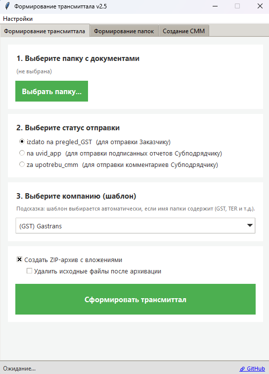
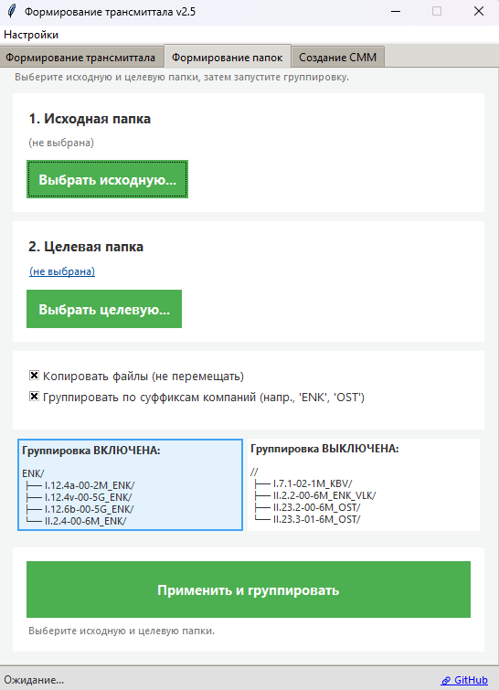

# Руководство по toir_tra_report

**Версия приложения:** 2.5

`toir_tra_report` автоматизирует подготовку трансмиттальных писем и разбор архивов документации ТОиР. Приложение предоставляет настольный интерфейс на Tkinter, который ускоряет сбор исходных файлов, заполняет Excel-шаблоны и формирует структуру выдачи для подрядчиков.

## Возможности

- Формирование Excel-писем передачи (`CT-*-TRA-PRM-*.xlsx`) с автозаменой дат, нумерацией и подстановкой описаний из `TZ_glob.xlsx`.
- Автоподбор шаблона по выбранному статусу и аббревиатуре компании, включая сохранение пользовательского пути в `settings.json`.
- Создание ZIP-архива вложений и, при необходимости, удаление исходных файлов после упаковки.
- Формирование индексных папок по кодам документов с использованием `index_folder_builder.prepare_index_folders`.
- CMM comment sheets for CT-DR via template `Template/CommentSheet_Template.xltx`.
- Поддержка копирования или переноса файлов и группировки выдачи по суффиксам (например, `ENK`, `OST`).
 - На вкладке «Формирование папок»: кликабельные области «Группировка ВКЛЮЧЕНА/ВЫКЛЮЧЕНА» переключают режим; у активной области отображается синяя рамка.

## Требования и установка

1. Установите Python 3.11+ и активируйте виртуальное окружение: `python -m venv .venv` → `.venv\Scripts\activate`.
2. Установите зависимости: `pip install openpyxl pytest pyinstaller`.
3. При необходимости зафиксируйте состав зависимостей через `pip-tools` (`pip-compile requirements.in`).
4. Запустите приложение: `python toir_tra_report_v1.py` (заголовок окна: «Формирование трансмиттала v2.5»).

## Структура проекта

- `toir_tra_report_v1.py` — GUI-приложение.
- `index_folder_builder.py` — логика разбиения файлов по индексам.
- `cmm_builder.py` - CMM generation helpers.
- `Template/` — шаблоны Excel и глобальные справочники (`TZ_glob.xlsx`).
- `settings.json` — пользовательские настройки путей и соответствий компаний.
- `tests/` — модульные тесты на pytest.

## Подготовка шаблонов

- Статусы шаблонов:
  - `izdato_na_pregled_gst` — комплектация «издано на просмотр».
  - `na_uvid_app` — выдача на ознакомление приложению.
  - `za_upotrebu_cmm` — выпуск «к эксплуатации СММ».
- Схема размещения: `Template/template_tra/<статус>/CT-<ABBR>-TRA-PRM-Template.xltx`.
- `TZ_glob.xlsx` должен содержать коды документов в колонке `C` и используется для подстановки описаний.
- `settings.json` сохраняет путь к каталогу `Template` и отображение `company_names`. Если файла нет, приложение создаёт его автоматически.

## Работа с GUI

### Вкладка «Передачное письмо»

1. Выберите папку с документами.
2. Задайте статус выпуска; список компаний фильтруется по файлам в каталоге.
3. При необходимости измените шаблон вручную.
4. Включите опции создания ZIP и удаления источников.
5. Нажмите «Сформировать письмо» — результат появится рядом с исходными файлами.

### Вкладка «Индексные папки»

1. Укажите исходную директорию с файлами и папку назначения.
2. Выберите режим: копирование (`use_copy=True`) либо перенос (`False`).
3. Включите группировку по суффиксам, если выдачу нужно разбить по коду из `TZ_glob.xlsx`.
4. Запустите процесс и откройте целевую директорию по ссылке в статус-баре.

## Использование модулей из кода

```python
from pathlib import Path
from index_folder_builder import prepare_index_folders

prepare_index_folders(
    source_dir=Path("input"),
    destination_dir=Path("output"),
    tz_file_path=Path("Template/TZ_glob.xlsx"),
    use_copy=True,
    group_by_suffix=True,
)
```

## Упаковка в исполняемый файл

```bash
pyinstaller --onefile --windowed --name toir_tra_report_v2.5 --icon=assets/icon_toir_tra_report.ico --add-data "Template;Template" toir_tra_report_v1.py
```

Исполняемый файл ищет `settings.json` и каталог `Template` рядом с собой и разворачивает недостающие ресурсы при первом запуске.

## Тестирование

- Быстрый прогон: `pytest -q`.
- Перед публикацией убедитесь, что проходят `ruff`, `black --check`, `mypy` (при наличии конфигурации).

## Частые проблемы

- Отсутствует `TZ_glob.xlsx`: добавьте файл в `Template` или обновите путь в `settings.json`.
- Пути шаблонов не найдены: используйте меню «Настройки → Указать каталог шаблонов…».
- Пустые описания документов: убедитесь, что индексы в именах файлов совпадают с кодами в `TZ_glob.xlsx`.
- ZIP-архив не создаётся: проверьте права на запись в целевую директорию.

## Визуальные примеры

| Формирование трансмиталла               | Выбор шаблона                                         |
| --------------------------------------------------------------- | ----------------------------------------------------------------- |
|  |  |

### Вкладка «Формирование папок»: переключение группировки

На карточке с примерами появились две кликабельные области. Клик по «Группировка ВКЛЮЧЕНА» включает режим, по «Группировка ВЫКЛЮЧЕНА» — отключает. Активная область выделяется синей рамкой.
